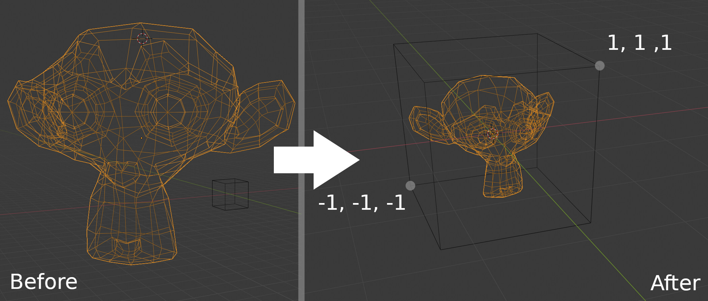

# Blender-Normalize-Object

Script to normalize the size of an object
The selected object is transformed to be at the center of the world, and within a cube of size 2.

Tested on Linux (Manjaro) with Blender 2.82a
